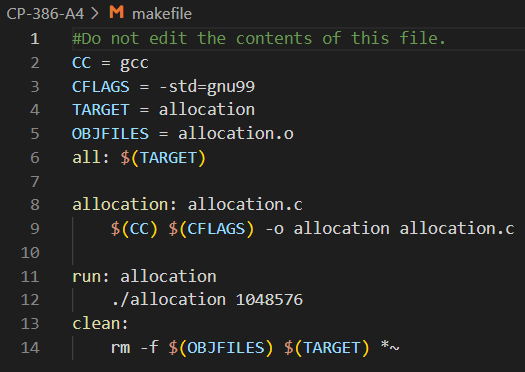

# Banker's Algorithm - CP-386 Operating System Group Assignment
This project is a group assignment for the CP-386 Operating System course. The goal of this assignment is to implement the Banker's Algorithm, a resource allocation and deadlock avoidance algorithm. 

## Contributors:
- Yash Rojiwadia: Main(), release_memory(), empty_stat(), First-fit() & Worst-fit()
- Jay Vora: Type Struct, Best-fit(), First-fit(), Worst-fit(), Main() & Stat()

## Screenshots:

## About the contributors:

- Jay Vora: I am a 3rd Year Computer Science Major student at Wilfrid Laurier University.
- Yash Rojiwadia: I am a 3rd year Computer Science Major student at Wilfrid Laurier University.
